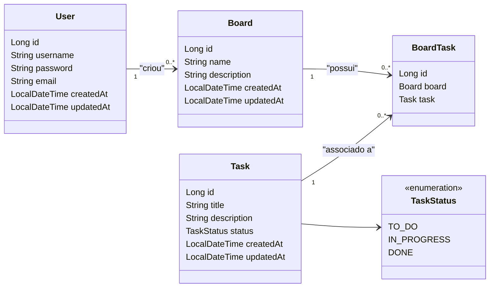

# 📋 Projeto Task Board

Este é um projeto de **Board de Tarefas** desenvolvido em **Java Spring Boot** usando **Gradle**. Ele utiliza **MySQL** como banco de dados e **Liquibase** para controle de versão do banco de dados. 🚀

---

## 📌 **Funcionalidades**
- 📑 Criação de Tarefas.
- 📝 Atualização de Tarefas.
- ❌ Exclusão de Tarefas.
- 📊 Consulta de Tarefas.
- 🧩 Organização das Tarefas em Quadros (Boards).
- 🔐 Autenticação de Usuários (básica).
- 🔍 Monitoramento de saúde da aplicação via Actuator.

---

## 🛠️ **Tecnologias Utilizadas**
- **Java 21** ☕
- **Spring Boot 3.x** 🌱
- **Gradle** (Build Tool) 📦
- **MySQL** (Banco de Dados Relacional) 🗄️
- **Liquibase** (Controle de Versionamento do Banco) 📜
- **Lombok** (Redução de Boilerplate) ✍️
- **Spring Data JPA** (ORM) 📚
- **Spring Validation** (Validação de dados) ✅

---

# Diagrama de Classes

